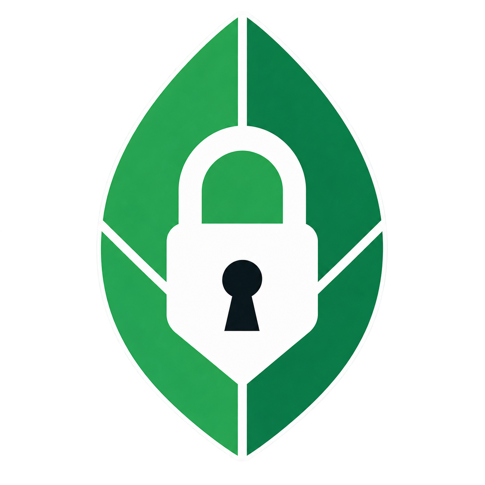

# Cipherleaf

<p align="center">
  
</p>

<p align="center">
  <a href="LICENSE"></a>
  <a href="https://github.com/VBenevides/cipherleaf/releases/latest"></a>
  <a href="https://github.com/VBenevides/cipherleaf/actions/workflows/codeql.yml"></a>
  <a href="https://github.com/VBenevides/cipherleaf/actions/workflows/security.yml"></a>
  <a href="https://sonarcloud.io/project/overview?id=VBenevides_cipherleaf"></a>
</p>

Cipherleaf is open-source software licensed under the [MIT License](LICENSE).
It is a local-first, encrypted Markdown notebook for desktop. It pairs a Go
backend with a React/CodeMirror interface through Wails v3 and supports Git
synchronization of an encrypted vault through a private GitHub repository over
SSH.

For the product value and security model, see the sections below.

## Documentation

- [User Guide](docs/USER-GUIDE.md) — setup, security, concepts, and feature reference
- [Examples](docs/examples/README.md) — numbered workflows with inline screenshots

## Main features

- Local-first encrypted vaults with manual locking, 15-minute automatic
  locking, recent-vault switching, and optional OS credential-store support
- Encrypted notes and titles in nested folders, with folder passwords, hiding,
  sorting, custom ordering, and drag-and-drop organization
- Live Preview, Object Tree, and source Markdown views with GFM tables, task
  lists, fenced code, headings, links, dividers, and collapsible nested sections
- `[[wikilinks]]`, backlinks, outgoing links, unresolved links, unlinked title
  mentions, inline tags, and navigable note-relationship and folder graphs
- Quick note switching, note-level search/replace, vault-wide search/replace,
  and advanced searches by title, content, tag, folder, property, date, case,
  or regular expression
- Typed frontmatter properties for structured, Markdown-compatible metadata
- Daily notes opened from a calendar, with configurable title formats, folders,
  template notes, and `{{title}}`, `{{date}}`, and `{{time}}` variables
- Encrypted pasted images and general file attachments, including export/open
  controls and authenticated attachment ownership
- Encrypted trash and note history with restore, permanent deletion,
  content-based deduplication, and a maximum of 20 retained versions
- Plaintext Markdown folder import and export for portability and independent
  backups, with explicit security warnings before export
- Autosave 60 seconds after editing stops, explicit save, word count, and an
  editing trail for recently opened notes
- Cipherleaf object notation: Markdown is represented internally as a versioned
  object document with stable IDs and parent/child relationships for text,
  sections, lists, checkboxes, images, and code blocks. This powers nested
  editing, indentation, collapsing, and drag-and-drop reordering while retaining
  Markdown source editing.
- Manual GitHub SSH sync, encrypted clone/restore, incremental synchronization,
  retry handling, conflict resolution, diagnostics, and force-push recovery
- Encrypted local-first time tracking with running timers, corrections, weekly
  and monthly calendars, project/tag organization, dashboard reporting, and
  explicit sync-conflict resolution

## Appearance and themes

Cipherleaf includes three built-in themes:

- **Light (Nord):** a cool, low-contrast light workspace
- **Dark (Nord):** a matching dark workspace for low-light environments
- **Archivist:** a warm paper-and-ink theme designed for long-form writing

Appearance settings also provide optional full or dotted journal lines, an
editor font-size range from 10–32 px, installed system fonts, and custom TrueType (`.ttf`) editor fonts.
Theme and installed-font preferences persist between sessions; imported font
data remains local to the application.

## Security model

- Each vault receives a random 256-bit master key.
- Vault creation presents a one-time CSPRNG-generated 256-bit vault secret.
- Argon2id derives the wrapping key from that secret using 64 MiB of memory and
  three iterations.
- XChaCha20-Poly1305 encrypts notes and metadata with a fresh random 192-bit
  nonce for every write.
- Large Markdown notes are gzip-compressed before authenticated encryption.
- Object headers are authenticated as associated data.
- Note filenames are opaque random IDs; titles are stored in the encrypted
  manifest.
- Writes use a mode-`0600` temporary file, flush, atomic rename, and an updated
  encrypted `.bak` recovery copy.
- Recent vault paths and theme preferences are stored in the user's application
  configuration directory. They contain no note content or vault secret.
- If the user enables secret remembering, the secret and its expiry are stored
  in macOS Keychain, Windows Credential Manager, or freedesktop Secret Service.
- GitHub receives the encrypted repository layout, not plaintext note content
  or the vault master key. The SSH private key remains a device-local file.
- Time entries, project/tag names, dates, bucket metadata, revisions, and
  tombstones use authenticated tracking-specific envelopes. Opaque monthly
  bucket paths reveal neither calendar months nor tracked activity.

Plaintext exists in application memory while a vault is unlocked. Cipherleaf
does not protect against malware, keyloggers, process-memory access, a
compromised operating system, or OS swap.

Save the generated vault secret before creating the vault. Losing it means
losing access; there is intentionally no reset or recovery mechanism.

## Stack used

| Layer | Technology |
| --- | --- |
| Desktop shell and bindings | Wails v3 beta.16 |
| Backend | Go 1.25 |
| Frontend | React 18 and TypeScript |
| Editor | CodeMirror 6 with a custom object-document layer |
| Markdown rendering | React Markdown and remark-gfm |
| Frontend tooling | Vite 8 and npm |
| Cryptography | XChaCha20-Poly1305 and Argon2id via `golang.org/x/crypto` |
| Image attachments | Go image codecs and WebP conversion |
| Remote sync | Git over SSH to a private GitHub repository |
| Secret storage | Native OS credential store through `go-keyring` |

## Prerequisites

- Go 1.25 or newer
- Node.js 22 or newer and npm
- Git, for GitHub synchronization
- Wails `v3.0.0-beta.16`:

  ```sh
  go install github.com/wailsapp/wails/v3/cmd/wails3@v3.0.0-beta.16
  ```

- The platform dependencies from the
  [Wails v3 installation guide](https://v3.wails.io/getting-started/installation/)

Linux secret remembering also requires a working freedesktop Secret Service.

## Development

Install frontend dependencies:

```sh
cd frontend
npm ci
cd ..
```

Run the desktop app with hot reload:

```sh
wails3 dev
```

Build a production desktop binary in `bin/`:

```sh
wails3 build
```

## Tests

Run the Go and frontend test suites:

```sh
go test ./...
npm --prefix frontend test
```

Check the production frontend build:

```sh
npm --prefix frontend run build
```

## Keyboard shortcuts

| Shortcut | Action |
| --- | --- |
| `Ctrl+N` | Create a note |
| `Ctrl+S` | Save the current note |
| `Ctrl+Shift+S` | Save and sync |
| `Ctrl+Shift+R` | Sync the vault |
| `Ctrl/Cmd+K` | Quick title/content search |
| `Ctrl/Cmd+Shift+F` | Search across notes |
| `Ctrl/Cmd+Shift+H` | Replace across notes |
| `Ctrl/Cmd+Shift+T` | Open the time-entry start form |
| `Ctrl/Cmd+Shift+E` | Confirm finishing the active timer |
| `Ctrl+]` / `Ctrl+[` | Expand/collapse the current outline section |
| `Ctrl+Shift+]` / `Ctrl+Shift+[` | Expand/collapse all outline sections |

Inside outline sections, `Tab` and `Shift+Tab` indent or outdent rows.
Consecutive `>` lines form one collapsible section; additional `>` characters
create nesting:

```markdown
> Project
> [ ] First task
>> [x] Completed subtask
> [ ] Second task
```

## GitHub SSH synchronization

Use a private GitHub repository created for one Cipherleaf vault. In Vault
Settings, provide its SSH URL, branch, and the local path to an SSH private key.
The app validates the connection before linking it.

On another device, **Clone from GitHub** reconstructs the vault from the
encrypted repository. The SSH key authorizes the download; the original vault
secret separately authenticates and decrypts it locally. Restore rejects
unknown files, mismatched vault IDs or hashes, wrong secrets, and
unauthenticated ciphertext without leaving a partial destination vault.

Sync exchanges encrypted snapshots, merges revisions, propagates deletions as
encrypted tombstones, and presents conflicting local and remote note content
for manual resolution. Reusing a deleted title creates a new object identity;
it does not revive the tombstone.

Time-tracking catalogs, monthly buckets, revisions, and tombstones travel in
the same encrypted snapshot lifecycle. Merging happens by logical entry,
project, and tag identity rather than bucket filename. Entry edits, overlaps,
label renames, and multiple active timers are preserved for explicit resolution;
push remains blocked while a tracking conflict is unresolved.

## Time tracking

Open **Time tracking** below **Graph view**. The Week and Month tabs use the
operating system's local calendar while persisted timestamps remain UTC. The
Dashboard supports preset or custom periods and project/tag filters. Projects
and tags can be archived without breaking historical entries.

Starting, finishing, correcting, or deleting an entry writes immediately.
The displayed running duration is calculated in memory and does not write a
new encrypted object every second. Locking or closing the vault clears the
decrypted tracking cache and removes the global running indicator.

## Project layout

```text
frontend/             React, CodeMirror, styles, generated Wails bindings, tests
internal/app/         Wails service boundary and image conversion
internal/vault/       Encrypted vault storage, search, merge, and recovery
internal/githubsync/  GitHub SSH repository management and sync state
internal/secretstore/ OS credential-store integration
internal/session/     Recent-vault and theme persistence
build/                Wails build and platform packaging configuration
local/                Design notes, plans, and feature-gap audits (gitignored)
```

Record each release under its `VERSION` in `CHANGELOG.md`, commit the changes,
then run `./create-release.sh`. The script creates the matching `v` tag and
GitHub release with those notes; GitHub Actions builds and attaches the Linux
amd64 and Windows amd64 artifacts.
