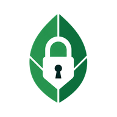

# Cipherleaf

<p align="center">
  
</p>

Cipherleaf is a local-first, encrypted Markdown notebook for desktop. It pairs
a Go backend with a React/CodeMirror interface through Wails v3 and can sync an
encrypted vault through a private GitHub repository over SSH.

> Cipherleaf is under active development. GitHub synchronization is
> experimental and should not replace an independent backup.

## Main features

- Encrypted vault creation, reopening, renaming, recent-vault switching, and
  manual or 15-minute automatic locking
- Encrypted notes and titles organized in multiple levels of nested folders,
  with folder passwords, hiding, sorting, custom ordering, and drag-and-drop
  movement of both notes and folders
- Live Preview and source Markdown modes with GFM tables, task lists, fenced
  code, links, headings, dividers, and custom collapsible outline sections
- `[[wikilinks]]`, backlinks, inline tags and tag filtering, title/content
  search, note search/replace, and vault-wide search/replace
- Encrypted pasted-image attachments, converted to WebP and rendered locally
- Autosave 60 seconds after editing stops, explicit save, word count, and an
  editing trail for recently opened notes
- An interactive graph view of the complete folder/note hierarchy, with nodes
  that open the selected folder or note
- Cipherleaf object notation: Markdown is represented internally as a versioned
  object document with stable IDs and parent/child relationships for text,
  sections, lists, checkboxes, images, and code blocks. This powers nested
  editing, indentation, collapsing, and drag-and-drop reordering while retaining
  Markdown source editing.
- Nord-inspired light and dark themes plus adjustable/custom editor fonts
- Manual GitHub SSH sync, encrypted clone/restore, conflict resolution, and
  force-push recovery controls
- Optional temporary vault-secret storage in the operating system credential
  store

The current graph visualizes the folder hierarchy rather than relationships
between notes. The calendar is a date picker, not a daily-notes system. See
[`local/note-taking-feature-gaps.md`](local/note-taking-feature-gaps.md) for the
current product-gap audit.

## Security model

- Each vault receives a random 256-bit master key.
- Vault creation presents a one-time CSPRNG-generated 256-bit vault secret.
- Argon2id derives the wrapping key from that secret using 64 MiB of memory and
  three iterations.
- XChaCha20-Poly1305 encrypts notes and metadata with a fresh random 192-bit
  nonce for every write.
- Large Markdown notes are gzip-compressed before authenticated encryption.
- Object headers are authenticated as associated data.
- Note filenames are opaque random IDs; titles are stored in the encrypted
  manifest.
- Writes use a mode-`0600` temporary file, flush, atomic rename, and an updated
  encrypted `.bak` recovery copy.
- Recent vault paths and theme preferences are stored in the user's application
  configuration directory. They contain no note content or vault secret.
- If the user enables secret remembering, the secret and its expiry are stored
  in macOS Keychain, Windows Credential Manager, or freedesktop Secret Service.
- GitHub receives the encrypted repository layout, not plaintext note content
  or the vault master key. The SSH private key remains a device-local file.

Plaintext exists in application memory while a vault is unlocked. Cipherleaf
does not protect against malware, keyloggers, process-memory access, a
compromised operating system, or OS swap.

Save the generated vault secret before creating the vault. Losing it means
losing access; there is intentionally no reset or recovery mechanism.

## Stack used

| Layer | Technology |
| --- | --- |
| Desktop shell and bindings | Wails v3 alpha |
| Backend | Go 1.25 |
| Frontend | React 18 and TypeScript |
| Editor | CodeMirror 6 with a custom object-document layer |
| Markdown rendering | React Markdown and remark-gfm |
| Frontend tooling | Vite 8 and npm |
| Cryptography | XChaCha20-Poly1305 and Argon2id via `golang.org/x/crypto` |
| Image attachments | Go image codecs and WebP conversion |
| Remote sync | Git over SSH to a private GitHub repository |
| Secret storage | Native OS credential store through `go-keyring` |

## Prerequisites

- Go 1.25 or newer
- Node.js 22 or newer and npm
- Git, for GitHub synchronization
- Wails `v3.0.0-alpha2.112`:

  ```sh
  go install github.com/wailsapp/wails/v3/cmd/wails3@v3.0.0-alpha2.112
  ```

- The platform dependencies from the
  [Wails v3 installation guide](https://v3.wails.io/getting-started/installation/)

Linux secret remembering also requires a working freedesktop Secret Service.

## Development

Install frontend dependencies:

```sh
cd frontend
npm ci
cd ..
```

Run the desktop app with hot reload:

```sh
wails3 dev
```

Build a production desktop binary in `bin/`:

```sh
wails3 build
```

## Tests

Run the Go and frontend test suites:

```sh
go test ./...
npm --prefix frontend test
```

Check the production frontend build:

```sh
npm --prefix frontend run build
```

## Keyboard shortcuts

| Shortcut | Action |
| --- | --- |
| `Ctrl+N` | Create a note |
| `Ctrl+S` | Save the current note |
| `Ctrl+Shift+S` | Save and sync |
| `Ctrl+Shift+R` | Sync the vault |
| `Ctrl/Cmd+K` | Quick title/content search |
| `Ctrl/Cmd+Shift+F` | Search across notes |
| `Ctrl/Cmd+Shift+H` | Replace across notes |
| `Ctrl+]` / `Ctrl+[` | Expand/collapse the current outline section |
| `Ctrl+Shift+]` / `Ctrl+Shift+[` | Expand/collapse all outline sections |

Inside outline sections, `Tab` and `Shift+Tab` indent or outdent rows.
Consecutive `>` lines form one collapsible section; additional `>` characters
create nesting:

```markdown
> Project
> [ ] First task
>> [x] Completed subtask
> [ ] Second task
```

## GitHub SSH synchronization

Use a private GitHub repository created for one Cipherleaf vault. In Vault
Settings, provide its SSH URL, branch, and the local path to an SSH private key.
The app validates the connection before linking it.

On another device, **Clone from GitHub** reconstructs the vault from the
encrypted repository. The SSH key authorizes the download; the original vault
secret separately authenticates and decrypts it locally. Restore rejects
unknown files, mismatched vault IDs or hashes, wrong secrets, and
unauthenticated ciphertext without leaving a partial destination vault.

Sync exchanges encrypted snapshots, merges revisions, propagates deletions as
encrypted tombstones, and presents conflicting local and remote note content
for manual resolution. Reusing a deleted title creates a new object identity;
it does not revive the tombstone.

## Project layout

```text
frontend/             React, CodeMirror, styles, generated Wails bindings, tests
internal/app/         Wails service boundary and image conversion
internal/vault/       Encrypted vault storage, search, merge, and recovery
internal/githubsync/  GitHub SSH repository management and sync state
internal/secretstore/ OS credential-store integration
internal/session/     Recent-vault and theme persistence
build/                Wails build and platform packaging configuration
local/                Design notes, plans, and feature-gap audits (gitignored)
```

Tagged releases are built for Linux amd64 and Windows amd64 by the GitHub
Actions release workflow. The application version is read from `VERSION`.
