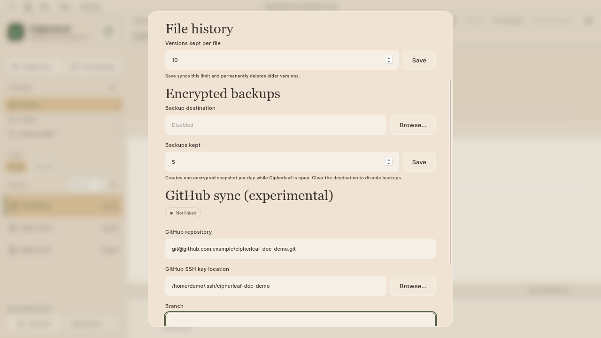
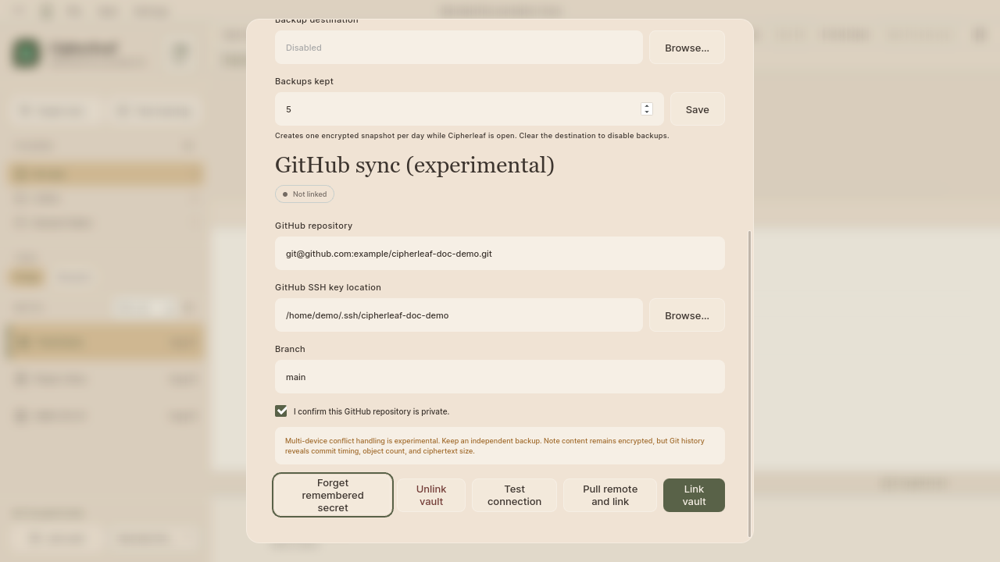

# GitHub synchronization

Configure optional encrypted-vault synchronization with a private GitHub
repository. This example uses a documented mock state only: no real
repository, SSH key, credential, clone, push, pull, or sync was used.
Use the disposable documentation vault from the
[vault-creation flow](../vault-creation/README.md). Never link an existing
vault during documentation work.

## Screenshots

### 1. Configure GitHub sync

The real Vault Settings window is filled with fake repository and key paths.
The status remains **Not linked**.

### 2. Review the privacy warning

The form requires a private-repository confirmation and warns that Git
history still reveals commit timing, object count, and ciphertext size.

## Steps

1. Create or select a new private GitHub repository with no personal data.
   Use a disposable repository for a real test.
2. Open **Vault → Vault Settings…**.
3. Enter the repository SSH URL, the SSH private-key path, and the branch.
   Verify that the key belongs to this test repository.
4. Confirm **I confirm this GitHub repository is private**.
5. For a real test, choose **Test connection**, then **Link vault** only after
   the connection succeeds. This capture stops before either action.
6. Save a note and choose **Save file and sync**. Use **Vault → Sync vault** to
   pull and push later.
7. Before cloning or restoring on another device, keep an independent backup,
   verify the vault secret, and confirm the destination is empty or disposable.
   **Pull remote and link** can change local state.

The note content remains encrypted in the repository, but repository metadata
and ciphertext sizes remain observable. Never place a vault secret or real SSH
key in a screenshot, issue, commit, or example.
