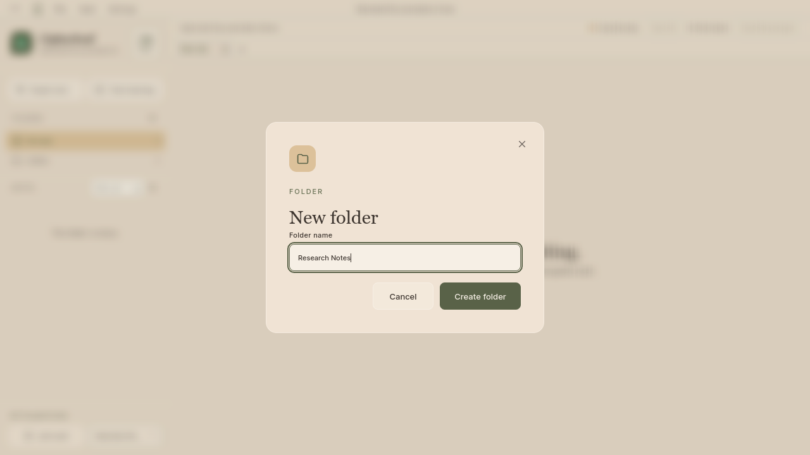
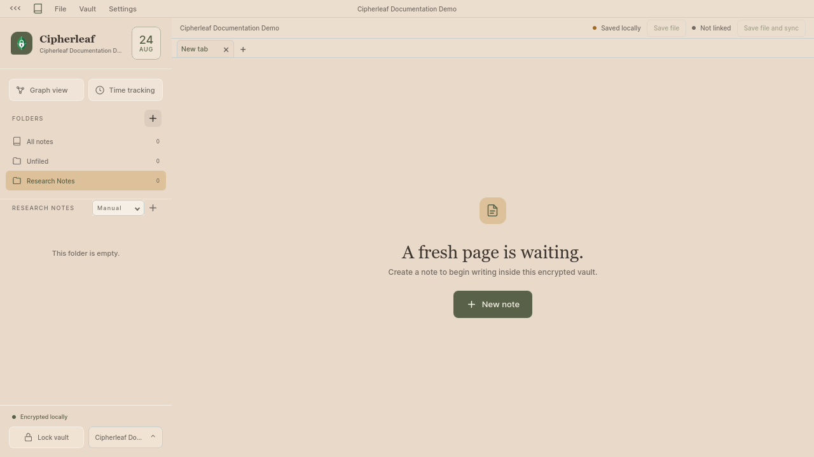
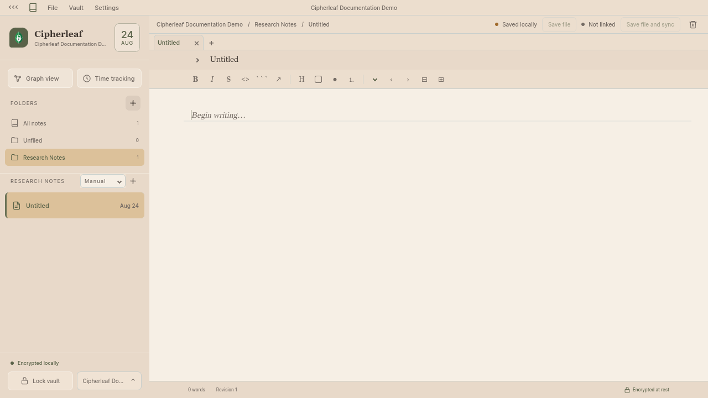
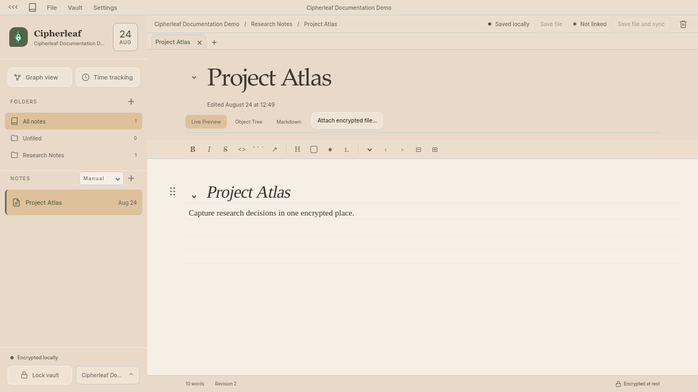
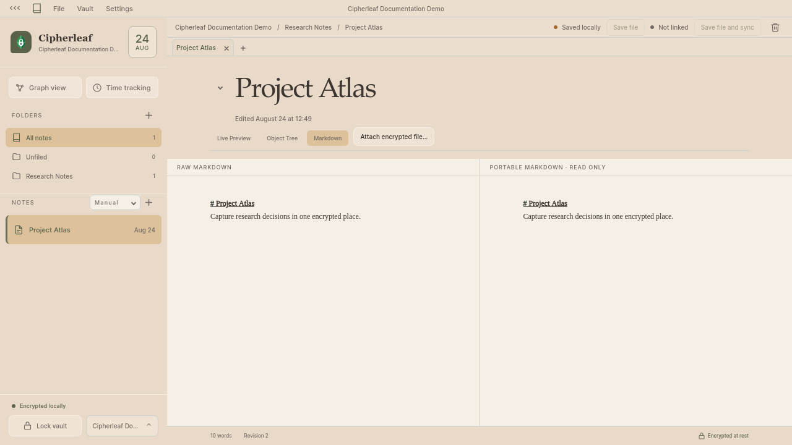

# Note workflow

Create a folder and note, edit fake Markdown, save it, and switch between
Cipherleaf editor views. Use the disposable documentation vault from the
[vault-creation flow](../vault-creation/README.md). Never open or change an
existing vault for a documentation capture.

## Screenshots

### 1. Create a folder



Enter a new folder name.

### 2. Select the new folder



The selected folder is ready for notes.

### 3. Create a note



The new note opens in the live editor.

### 4. Edit and save the note



Fake Markdown is saved locally in the encrypted vault.

### 5. Switch to Markdown view



Compare raw and portable Markdown.

## Steps

1. Unlock the disposable documentation vault and select the **+** beside
   **Folders**.
2. Enter a fake folder name, such as `Research Notes`, then choose **Create
   folder**.
3. Select the **+** beside the folder's notes, or press `Ctrl+N`, to create a
   note. The new note opens as `Untitled`.
4. Expand the note title, set it to `Project Atlas`, and enter fake content:

   ```markdown
   # Project Atlas

   Capture research decisions in one encrypted place.

   - Owner: Demo team
   - Status: Draft
   ```

5. Save with `Ctrl+S` or **Save file**. Confirm the status says **Saved
   locally** and the footer says **Encrypted at rest**.
6. Choose **Markdown** to switch from **Live Preview**. The view shows the
   editable raw Markdown beside the read-only portable Markdown.

The expected result is a `Project Atlas` note inside `Research Notes`, with
only fake data in the screenshots.
