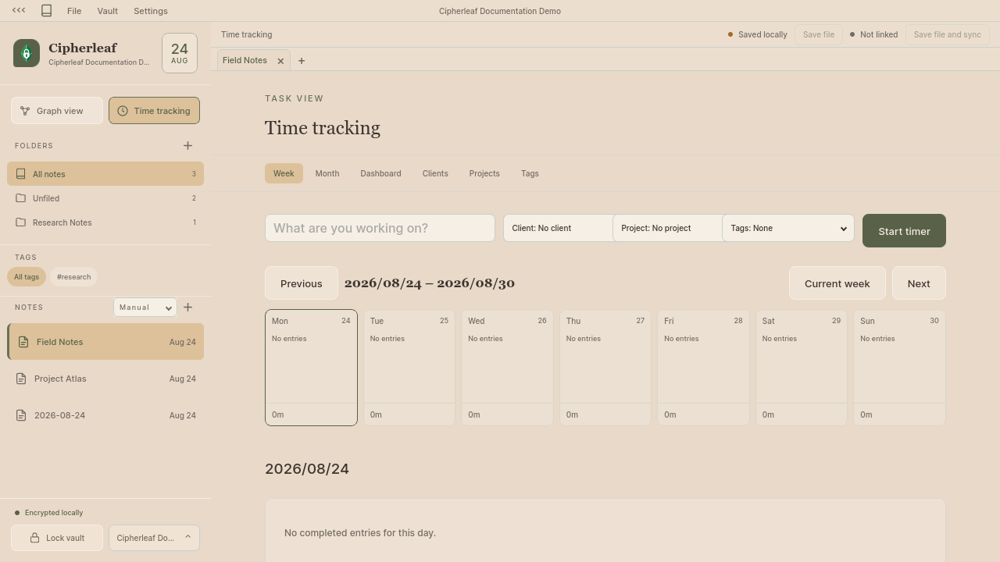
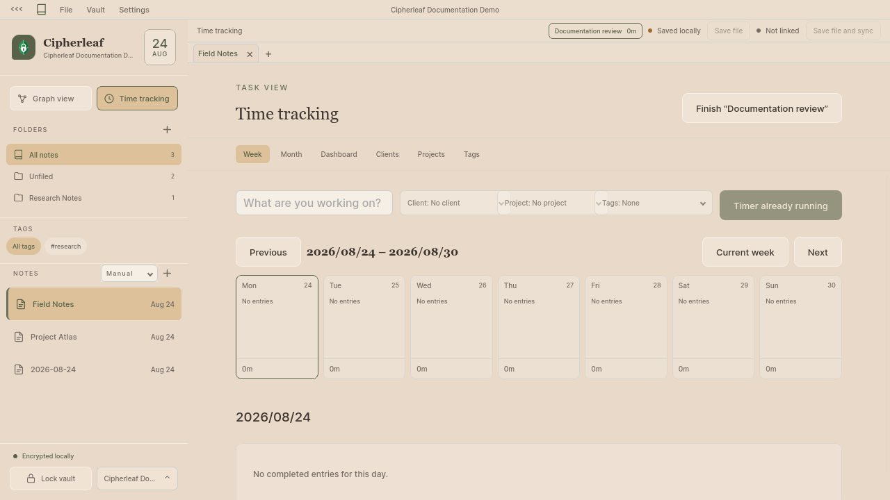
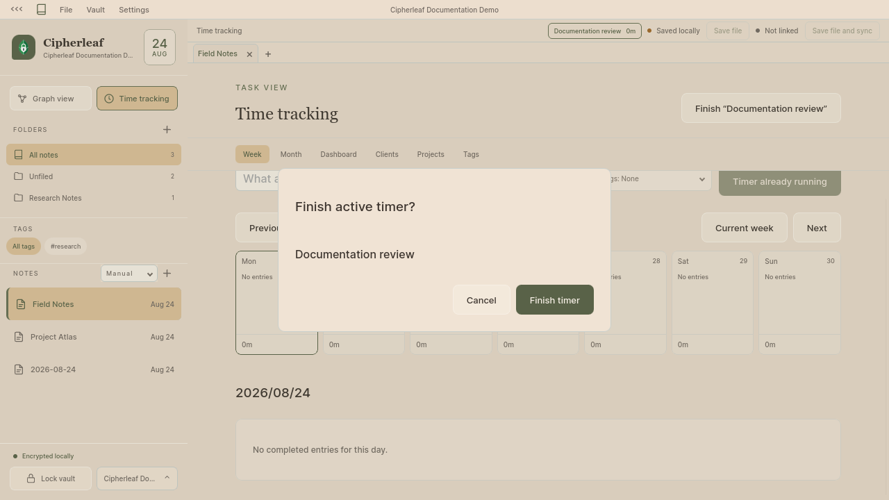
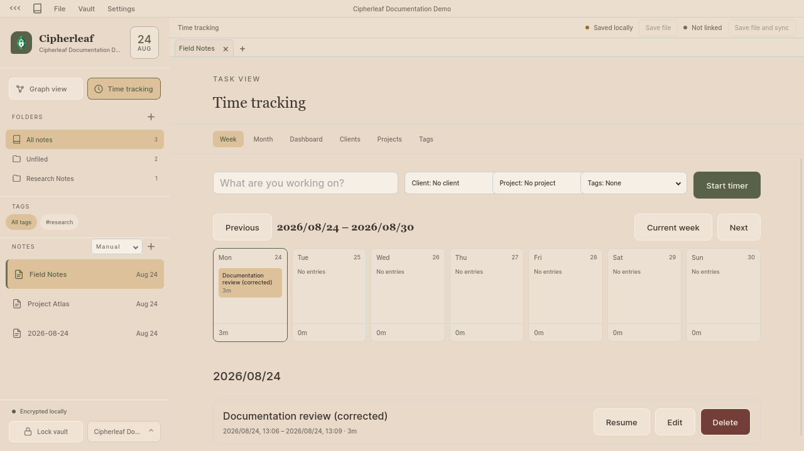
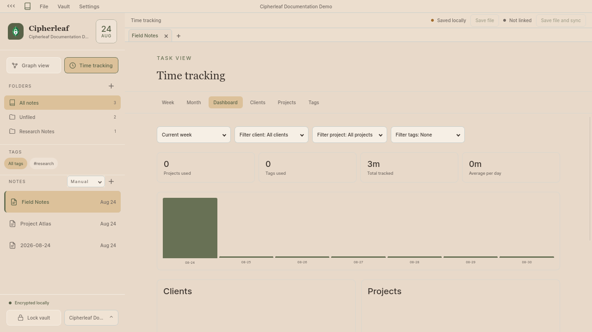

# Time tracking

Start, finish, correct, and review a fake encrypted time entry. Use the
disposable documentation vault from the
[vault-creation flow](../vault-creation/README.md). Never use an existing
vault for a documentation capture.

## Screenshots

Open **Time tracking** to see the week view and the empty entry form.

Enter the fake task `Documentation review` and choose **Start timer**.

Choose **Finish “Documentation review”**, then confirm **Finish timer**.

Edit the completed entry and save the fake name `Documentation review (corrected)`.

Open **Dashboard** to review the tracked total and daily chart.

## Steps

1. Choose **Time tracking** in the sidebar.
2. Enter a fake task name. Leave client, project, and tag empty unless the
   disposable vault has fake catalog values.
3. Choose **Start timer**. Work normally, then choose **Finish** and confirm
   the finish dialog.
4. Select the completed entry's **Edit** button to correct its name, dates, or
   times. Choose **Save correction**.
5. Switch to **Dashboard** and review the week or month totals.

The expected result is one completed, editable entry in the selected calendar
period. Do not record real work data in screenshots or documentation examples.
