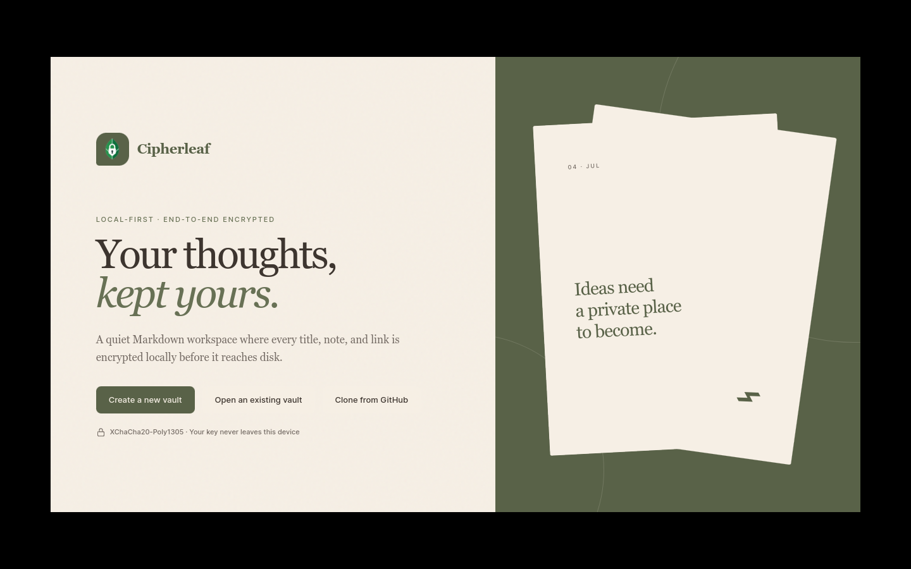
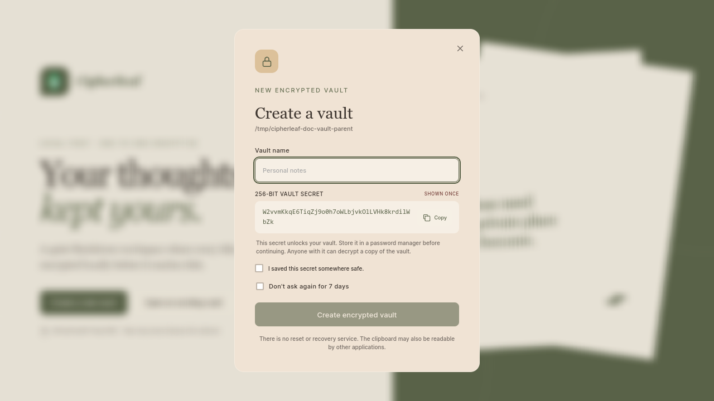
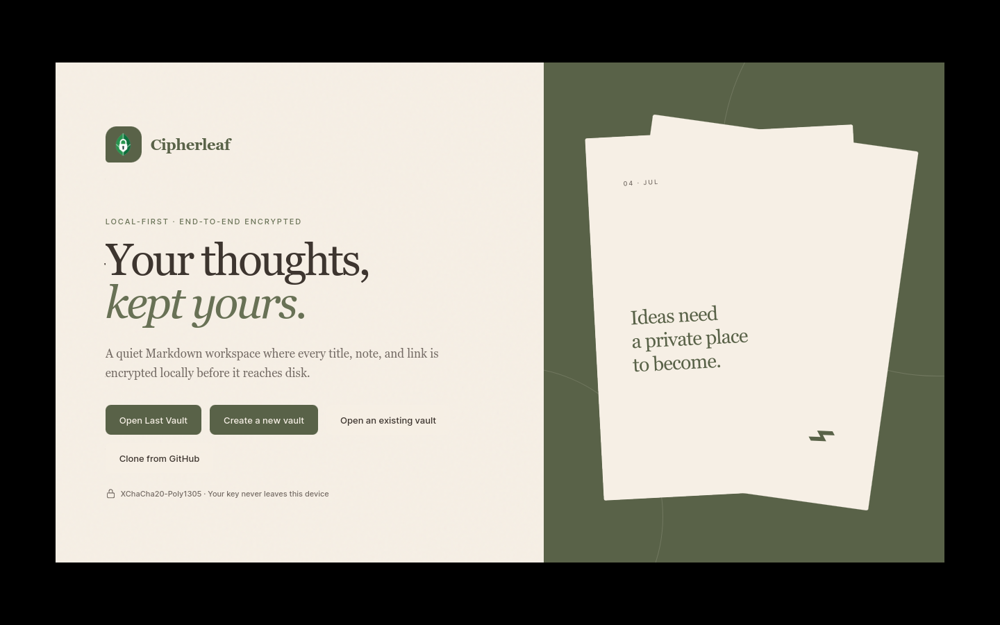
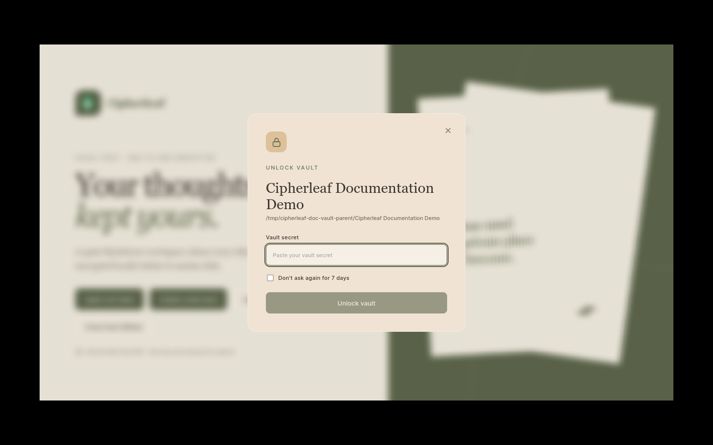
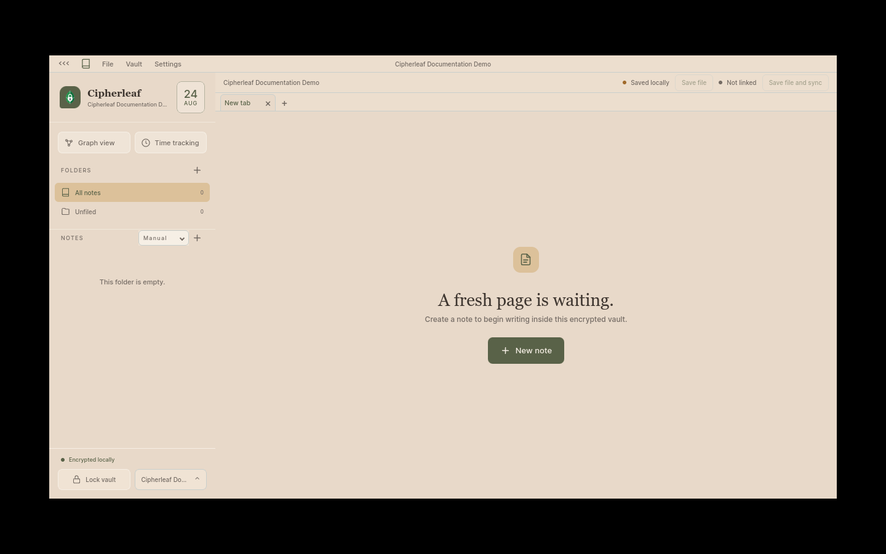

# Vault creation

Create and protect a new Cipherleaf vault, then lock and unlock it. Use a new
disposable vault for this walkthrough. Do not open, edit, or overwrite an
existing vault.

## Screenshots

### 1. Choose **Create a new vault**

Choose **Create a new vault**.

### 2. Save the generated secret

The app displays a one-time 256-bit vault secret.

### 3. Open the new demo vault

The fresh vault is available from the locked welcome window.

### 4. Unlock the vault

Enter the vault secret.

### 5. Start with an empty encrypted vault

The unlocked workspace is ready for the first note.

The generated secret in screenshot 02 belongs to an unused disposable capture
and must never be reused. Do not capture or publish a real user's vault
secret. The native folder-picker contents are not captured.

## Steps

1. Start Cipherleaf and choose **Create a new vault**.
2. Choose a new parent folder. Select the parent directory, not an existing
   Cipherleaf vault.
3. Enter a fake vault name, such as `Cipherleaf Documentation Demo`.
4. Copy the generated **256-bit vault secret** to a password manager or other
   secure location. Confirm that you saved it.
5. Choose **Create encrypted vault**.
6. When finished, choose **Lock vault**.
7. Choose **Open Last Vault**, enter the saved secret, and choose **Unlock
   vault**.

The final state should show an empty encrypted workspace. Continue with the
[note workflow](../note-workflow/README.md) to create the first fake note.
